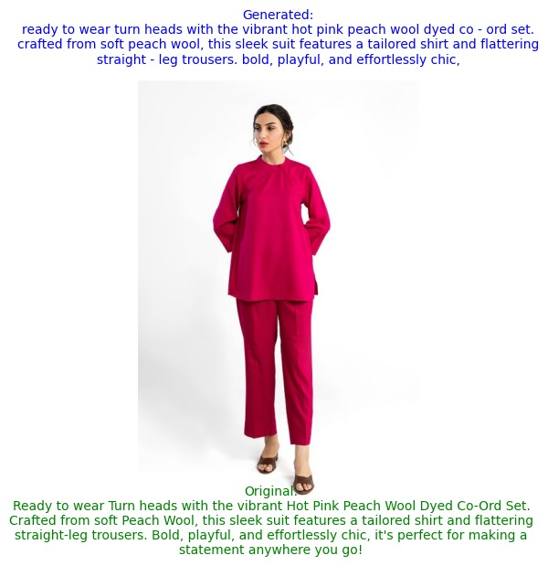
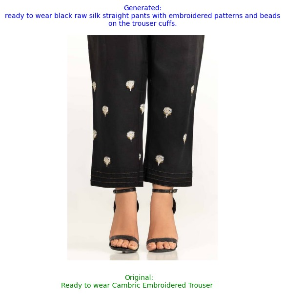
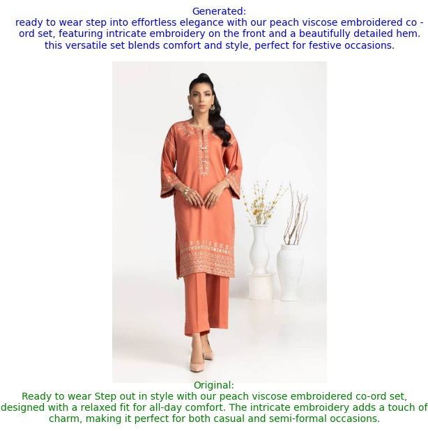
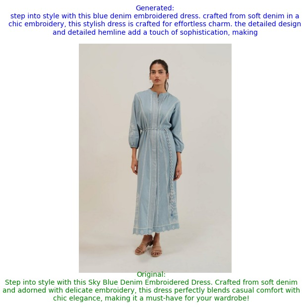
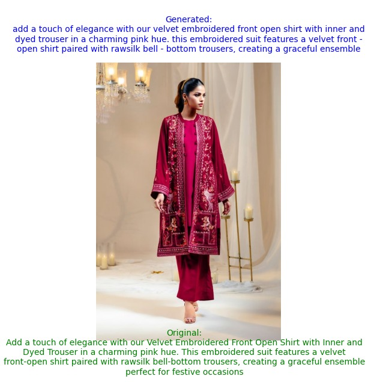
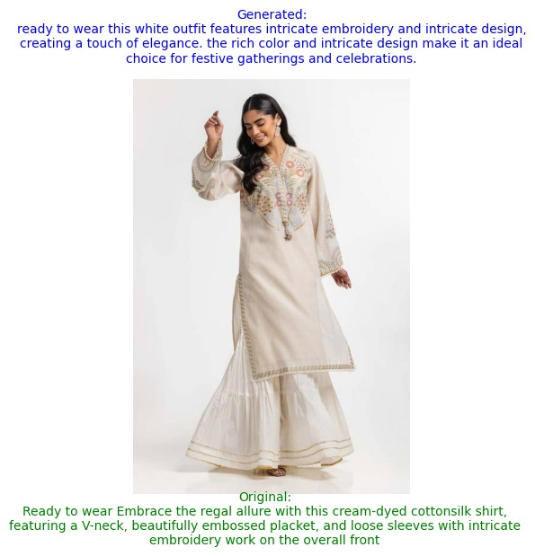
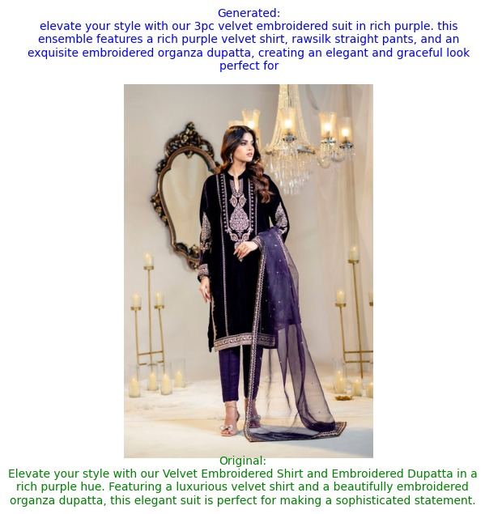
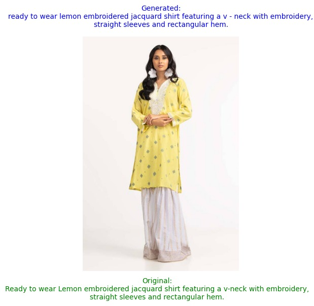
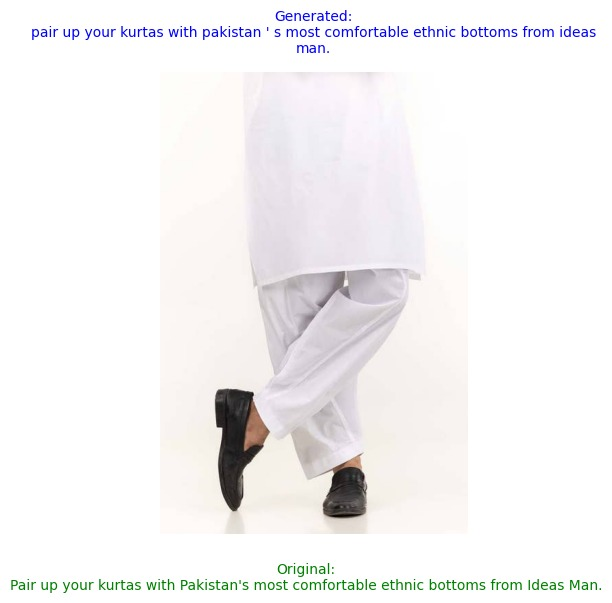

# Improving Image Captioning on Asian Cultural Dresses

## Overview
This repository supports research focused on enhancing the image captioning capabilities of vision-language models, particularly for South Asian cultural dresses. Current models and datasets, such as DeepFashion, lack adequate representation of these culturally rich and diverse apparel types. This project aims to fill that gap by creating a specialized dataset, fine-tuning existing models, and developing improved architectures for image captioning and recognition.

### Research Objectives
1. **Dataset Creation:**
   - Gather a dataset of South Asian dresses by scraping data from leading clothing brands.
   - Annotate images with captions describing fabric types, dress styles, and design elements.

2. **Fine-Tuning Vision-Language Models:**
   - Experiment with models like BLIP to assess their ability to caption and recognize South Asian apparel.
   - Evaluate model performance and benchmark results.

3. **Model Development:**
   - Propose and develop encoder-decoder architectures inspired by BLIP and CLIP to improve captioning accuracy.
   - Address underrepresentation of South Asian apparel in current datasets.

4. **Segmentation:**
   - Process images to segment components such as Shalwar, Kameez, Dupatta, and other traditional dress elements.

### Scope of Research
- **Fabric Recognition:** Lawn, Velvet, Chiffon, Cotton, Khadar, Karandi, Linen, Silk, Wool, Denim.
- **Apparel Types:** Embroidered, Printed, and traditional categories like Co-ords, Scarves, and Pajamas.
- **Cultural Heritage:** Promotes the preservation of South Asian cultural apparel through AI advancements.

---

## Repository Details
### Directory Structure
```
└── moazzamumer-Image-Captioning-Research/
    ├── BLIP_for_generation.py                # Script for generating captions using BLIP.
    ├── Fine_tune_BLIP_on_an_image_captioning_dataset.ipynb # Jupyter notebook for fine-tuning BLIP.
    ├── basic_script_ga.py                    # Script for initial processing of Gul Ahmed data.
    ├── evaluation_scores.csv                 # Evaluation scores for fine-tuned models.
    ├── ga_urls.txt                           # URLs used for scraping data.
    ├── results.ipynb                         # Notebook for analyzing results.
    ├── results.py                            # Script for generating result visualizations.
    ├── scraped_intermediate_info.json        # Intermediate data from scraping.
    ├── single_entity_data_ga.py              # Script for processing single-entity data.
    ├── trained_blip_results.csv              # Results from the fine-tuned BLIP model.
    └── gul-ahmed-data/
        ├── gul_ahmed_metadata.csv            # Metadata of Gul Ahmed dataset.
        ├── image_id_iterator.txt             # Iterator for image IDs.
        └── images/                           # Folder containing scraped images.
```

### Key Files
- **`BLIP_for_generation.py`**: Script for generating captions using the BLIP model.
- **`Fine_tune_BLIP_on_an_image_captioning_dataset.ipynb`**: Notebook for fine-tuning the BLIP model on a custom dataset.
- **`evaluation_scores.csv`**: Contains scores evaluating model performance.
- **`results.py`**: Script for generating and analyzing results.
- **`gul-ahmed-data/`**: Directory containing images, metadata, and other scraped information from the Gul Ahmed dataset.

---

## Getting Started
### Prerequisites
- Python 3.8+
- Required libraries: `torch`, `transformers`, `pandas`, `numpy`, `opencv-python`

### Installation
1. Clone the repository:
   ```bash
   git clone https://github.com/your-username/moazzamumer-Image-Captioning-Research.git
   cd moazzamumer-Image-Captioning-Research
   ```
2. Install dependencies:
   ```bash
   pip install -r requirements.txt
   ```

### Usage
- **Fine-tune BLIP Model:** Use `Fine_tune_BLIP_on_an_image_captioning_dataset.ipynb` for model fine-tuning.
- **Generate Captions:** Run `BLIP_for_generation.py` to generate captions for images.
- **Evaluate Results:** Use `results.ipynb` or `results.py` for analyzing model outputs.

---

## Results
- Preliminary results show improved captioning performance for South Asian apparel.
- The fine-tuned BLIP model demonstrates enhanced recognition of fabric types and dress styles compared to baseline models.











---

## Future Work
- Expanding the dataset to include more diverse apparel types and regional variations.
- Developing a custom vision-language model tailored to South Asian cultural data.
- Exploring multi-lingual captioning capabilities.

---

## Contributing
Contributions are welcome! Please fork the repository and submit a pull request for review.

---

## License
This project is licensed under the [MIT License](LICENSE).

---

For any inquiries or further information, please contact moazzamumar22@gmail.com.
